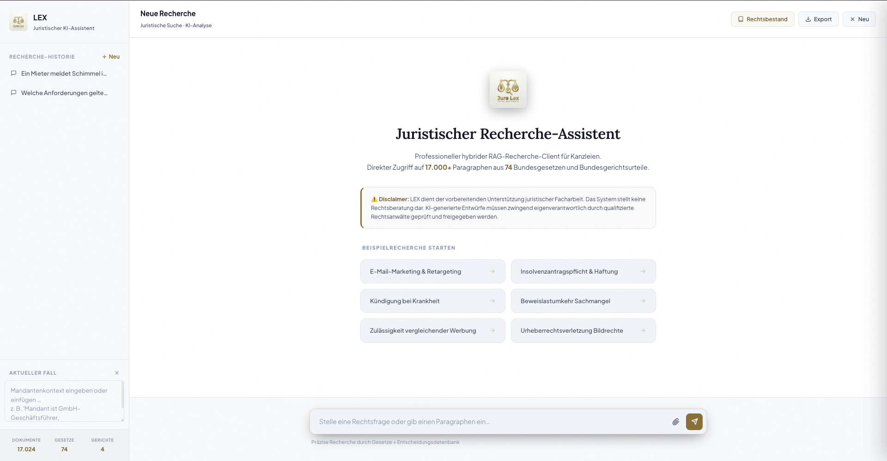

<div align="center">

# Legal RAG — German Law Search & Q&A

**A technical exploration of deterministic quality control in legal retrieval-augmented generation.**

**[Live Demo →](https://aliundmaggy--legal-rag-fastapi-app.modal.run)**

[](https://python.org/)
[](https://fastapi.tiangolo.com/)
[](https://modal.com/)
[](https://qdrant.tech/)
[](https://ai.google.dev/)
[](https://pytest.org/)

<br>



</div>

---

## Why This Exists

Most legal RAG systems treat retrieval as a black box: embed a query, fetch top-k results, feed them to an LLM, and hope the answer is correct. In high-stakes domains like law, that approach fails in predictable ways:

- The model cites plausible-sounding but **wrong statutes** (e.g., rent termination rules when asked about employment termination)
- **Mandatory sources** are missing because they didn't rank high enough semantically
- There is **no verification** whether the generated answer actually cites the sources it was given
- Quality depends entirely on prompt wording, which is **invisible and fragile**

This project explores a different approach: **deterministic, code-level quality control** layered on top of standard RAG. The system encodes legal retrieval requirements as data-driven profiles, mechanically injects and filters sources before generation, and audits the generated answer against its own sources after generation.

> This is a portfolio project and technical showcase. It is not legal advice and not a production legal tool.

---

## Key Technical Ideas

### 1. Deterministic Legal Quality Profiles

Instead of relying on prompt engineering for correctness, legal retrieval requirements are encoded in [`legal_quality.py`](src/retrieval/legal_quality.py) as structured profiles.

For a recognized legal issue (e.g., ordinary employee termination), the system:

- **Injects mandatory sources** (`BGB § 623`, `KSchG § 1`, `BetrVG § 102`, ...) before generation, regardless of semantic ranking
- **Removes known false positives** (`BGB § 580a` — a rent-law provision that semantically matches termination queries)
- **Restricts the source set** to allowed law families for the detected issue
- Returns an auditable `retrieval_plan` and `source_audit` alongside every answer

This makes retrieval behavior **testable, explainable, and reproducible** — not dependent on which embedding happens to rank highest.

### 2. Post-Generation Answer Auditing

The system doesn't trust the LLM. After generating an answer, [`answer_audit.py`](src/retrieval/answer_audit.py) mechanically checks:

- Every material legal claim has a source citation
- Cited source IDs actually exist in the provided context
- Referenced paragraphs match the cited sources
- Required norms from the retrieval plan appear in the answer
- Profile-specific deadlines (e.g., the 3-week KSchG § 4 claim deadline) are not omitted
- Overconfident language ("always", "guaranteed") is flagged

The audit returns a structured `pass` / `warn` / `fail` status with issue details. The prompt still asks the model to cite sources — the auditor enforces it.

### 3. Contract-Based Evaluation

The eval set in [`kanzlei_core.json`](evals/kanzlei_core.json) intentionally does **not hardcode model answers**. Each case defines a source-level quality contract:

```json
{
  "id": "arbeitsrecht_kuendigung_ordentlich_001",
  "must_include": ["BGB § 623", "KSchG § 1", "KSchG § 4", "BetrVG § 102"],
  "must_not_include": ["BGB § 580a", "BetrVG § 103"],
  "expected_profiles": ["arbeitsrecht_ordentliche_kuendigung_arbeitnehmer"],
  "max_high_audit_issues": 0
}
```

This tests whether the **pipeline delivers the right sources and maintains audit quality** — independent of how the model phrases its answer. Cases are split into `regression_guard` (blocking) and `known_gap` (tracking) groups.

---

## How It Works

### Hybrid Search Pipeline

The retrieval layer combines multiple signals rather than relying on a single embedding:

- **Dense retrieval** with `BAAI/bge-m3` for semantic similarity
- **Learned sparse vectors** for exact legal terminology matching (§-references, law abbreviations)
- **Weighted dense/sparse fusion** via Qdrant's hybrid search
- **Cross-encoder reranking** with `BAAI/bge-reranker-v2-m3`
- **Exact paragraph pinning** for queries like `§ 242 BGB`
- **Automatic law filtering** for abbreviations like `BGB`, `KSchG`, `StGB`

### German Legal Corpus

The demo index covers:

- **17,024** indexed documents from **74** German federal laws
- **16,242** law paragraphs scraped from [gesetze-im-internet.de](https://www.gesetze-im-internet.de)
- **782** court-decision chunks from **398** unique decisions (incl. 201 BGH) from [rechtsprechung-im-internet.de](https://www.rechtsprechung-im-internet.de)
- Structured metadata: law abbreviation, paragraph, title, legal area, date, court, file number
- A NetworkX knowledge graph built from cross-paragraph references

### Chat Interface

- Server-Sent Events streaming with FastAPI on Modal
- Gemini as default LLM with DeepSeek and Anthropic fallback
- Citation cards with source previews
- Chat always routes through the enhanced analysis pipeline, never raw search output

---

## Architecture

```text
gesetze-im-internet.de          rechtsprechung-im-internet.de
        |                                  |
        v                                  v
  GesetzeScraper                    UrteileScraper
        |                                  |
        +---------------+------------------+
                        v
        Cleaner -> MetadataExtractor -> Chunker
                        |
                        v
                 LegalRAGPipeline
                        |
        +---------------+------------------+
        |                                  |
        v                                  v
  bge-m3 embeddings                 NetworkX legal graph
 dense + learned sparse             paragraph references
        |
        v
 Qdrant local collection
        |
        v
 Weighted fusion -> Cross-encoder reranker
        |
        v
 EnhancedLegalSearch
 classify -> rewrite -> RRF -> quality audit
        |
        v
 FastAPI / Modal / LEX UI
```

| Layer | Technology |
|---|---|
| Runtime | Python 3.12 |
| API | FastAPI ASGI |
| Deployment | Modal, GPU T4, persistent Volume |
| Vector Search | Qdrant local mode |
| Embeddings | `BAAI/bge-m3` dense + sparse |
| Reranking | `BAAI/bge-reranker-v2-m3` |
| Legal Graph | NetworkX GraphML |
| LLM Providers | Gemini, DeepSeek, Anthropic |
| Tests | Pytest |

---

## API Endpoints

| Route | Purpose |
|---|---|
| `GET /` | LEX chat UI |
| `GET /api/legal/search` | Raw hybrid retrieval |
| `GET /api/legal/ask` | Search + generated answer |
| `GET /api/legal/ask/stream` | Streaming legal analysis |
| `GET /api/legal/ask/enhanced` | Enhanced retrieval + source/answer audits + generated answer |
| `GET /api/legal/related/{doc_id}` | Knowledge-graph related paragraphs |
| `GET /api/legal/stats` | Index statistics |

Try it:

```bash
curl --get "https://aliundmaggy--legal-rag-fastapi-app.modal.run/api/legal/ask/enhanced" \
  --data-urlencode "q=Welche Anforderungen gelten für eine ordentliche Kündigung eines Arbeitnehmers?" \
  --data-urlencode "top_k=8"
```

---

## Project Structure

```text
.
├── main.py                         # CLI entry point
├── modal_deploy.py                 # Modal FastAPI deployment + LEX persona
├── rebuild_clean.py                # index cleanup and rebuild logic
├── evals/
│   └── kanzlei_core.json           # source/audit regression contracts
├── src/
│   ├── scrapers/                   # German laws, rulings, EUR-Lex scaffold
│   ├── processors/                 # cleaning, metadata, chunking
│   ├── ingestion/rag_pipeline.py   # embeddings, Qdrant, fusion, reranking
│   ├── retrieval/
│   │   ├── enhanced_search.py      # classify -> rewrite -> RRF -> quality layer
│   │   ├── answer_audit.py         # post-generation source-level answer audit
│   │   ├── legal_quality.py        # deterministic source profiles and audits
│   │   ├── query_classifier.py
│   │   ├── eval_runner.py          # deterministic eval-set checks
│   │   └── query_rewriter.py
│   ├── scheduler/
│   └── static/demo_ui.html
├── tests/
│   ├── test_legal_quality.py
│   ├── test_answer_audit.py
│   ├── test_eval_runner.py
│   ├── test_demo_ui.py
│   └── test_retrieval_quality.py
├── scripts/
└── requirements.txt
```

---

## Local Development

### Prerequisites

- Python 3.12
- Modal account for deployment
- Gemini API key for answer generation

### Setup

```bash
python -m venv .venv
source .venv/bin/activate
pip install -r requirements.txt
```

### Environment

```env
GEMINI_API_KEY=...
GEMINI_MODEL=gemini-2.5-flash-lite
LLM_PROVIDER=gemini

DEEPSEEK_API_KEY=...
ANTHROPIC_API_KEY=...

LEGAL_RAG_STORAGE=legal_rag_storage
EMBEDDING_MODEL_NAME=BAAI/bge-m3
RERANKER_MODEL_NAME=BAAI/bge-reranker-v2-m3
```

### CLI

```bash
python main.py --stats
python main.py --search "Treu und Glauben" --top-k 5
python main.py --search "§ 242 BGB" --gesetz BGB
python main.py --run-gesetze
python main.py --run-urteile
```

---

## Deployment

```bash
modal setup
modal deploy modal_deploy.py
```

The demo runs on Modal with a T4 GPU, persistent volume for the index, and named secrets for LLM API keys.

---

## Testing

```bash
python -m pytest -q
python -m pytest tests/test_legal_quality.py -q
python -m pytest tests/test_answer_audit.py tests/test_eval_runner.py -q
python -m pytest tests/test_retrieval_quality.py -v -s
```

Current fast suite: **72 passed, 3 skipped**.

Tests cover:

- Mandatory-source injection and false-positive filtering
- Post-generation answer grounding audit
- Eval-set schema and regression-gate checks
- Knowledge-graph expansion regressions
- UI routing guards (chat never falls back to raw search)
- Retrieval quality across legal domains

---

## What This Doesn't Do

This is a technical showcase, not a production legal tool. Deliberate scope limits:

- The index covers 74 selected federal laws and ~400 court decisions — a tiny fraction of German law
- No historical law versioning
- Only one detailed quality profile (employment termination); a real system would need hundreds
- EUR-Lex integration is scaffolded but not connected
- Scraping requires a residential network (some sources block datacenter IPs)

These limitations are intentional. The point of the project is the **architecture and quality-control approach**, not corpus completeness.

---

## If This Were Production

A few directions that would matter for real-world use:

- **More quality profiles**: every high-value legal workflow needs its own source requirements, exclusions, and answer-focus rules
- **Separate statute and case-law retrieval**: retrieve norms and decisions in independent channels, fuse after validation
- **Robust citation resolution**: replace regex-only parsing with a proper German norm resolver for `§§`, `Abs.`, `Satz`, and law abbreviations
- **Blocking answer audit**: surface `fail` status in the UI and prevent overconfident delivery when sources are missing
- **Broader corpus**: full federal law coverage, more court decisions, and provenance tracking per document

---

## License

**Proprietary / Portfolio Showcase**
All rights reserved by Klein Digital Solutions.

<div align="center">
  <sub>Built as a technical portfolio project exploring deterministic quality control in legal RAG.</sub>
</div>
